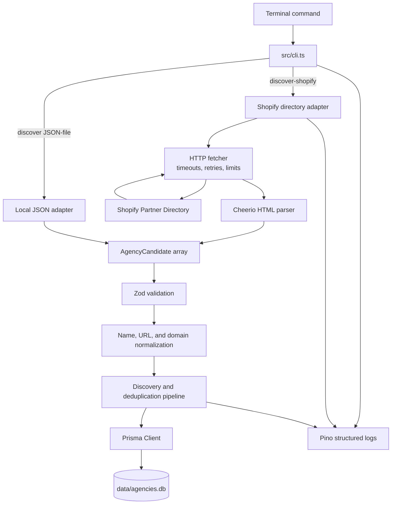
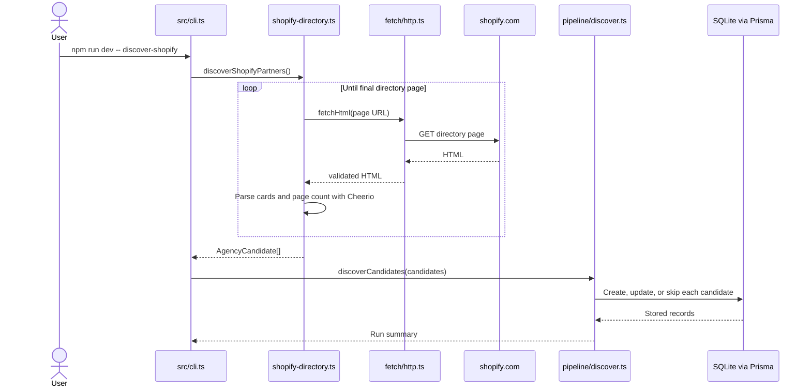

# Agency Discovery

A local TypeScript CLI for discovering development agencies from public directories, normalizing their URLs, preventing duplicate records, and saving candidates to SQLite.

This project is source-agnostic and is being built incrementally. Shopify's public Partner Directory is the first discovery adapter; additional agency directories can be added behind the same candidate interface. Official website verification, agency classification, careers-page discovery, and ATS detection are planned next.

## Current capabilities

- Crawl the public Shopify service-partner directory across dynamically detected pages.
- Extract partner names and Shopify profile URLs with Cheerio.
- Import candidates from a local JSON file for controlled testing.
- Validate runtime data and configuration with Zod.
- Normalize URLs, remove tracking parameters, and extract registrable domains.
- Prevent duplicate candidates across repeated discovery runs.
- Persist records locally in SQLite through Prisma.
- Emit structured progress and error logs with Pino.
- Apply request timeouts, retries, response-size limits, and a delay between Shopify pages.

The Shopify directory contains agencies, freelancers, and other service partners. Discovery intentionally stores all official listings; a later verification stage will determine which records are agencies.

## Architecture



### Shopify discovery flow



## Technology

- Node.js 20
- TypeScript
- `tsx`
- Cheerio
- Playwright (reserved for pages that require browser rendering)
- Prisma
- SQLite
- Zod
- Pino
- `tldts`

## Project structure

```text
.
├── data/
│   ├── agencies.db                 # Local database; ignored by Git
│   └── candidates.example.json     # Example manual input
├── prisma/
│   ├── migrations/                 # Database migrations
│   └── schema.prisma               # Agency model and statuses
├── src/
│   ├── cli.ts                      # CLI entry point and command routing
│   ├── config.ts                   # Zod-validated environment configuration
│   ├── db.ts                       # Shared Prisma client
│   ├── logger.ts                   # Shared Pino logger
│   ├── discovery/
│   │   ├── types.ts                # Common candidate contract
│   │   └── sources/
│   │       ├── local-json.ts        # Local JSON discovery adapter
│   │       └── shopify-directory.ts # Shopify directory adapter and parser
│   ├── fetch/
│   │   └── http.ts                 # Bounded HTTP fetching and retries
│   ├── pipeline/
│   │   └── discover.ts             # Persistence and preliminary deduplication
│   └── utils/
│       ├── domain.ts               # Canonical domain helpers
│       └── url.ts                  # URL parsing and normalization
└── tests/unit/                     # Unit and fixture-style parser tests
```

## Setup

### 1. Select Node.js

Install NVM if necessary, then from the project root run:

```bash
nvm use
```

The repository's `.nvmrc` selects Node.js 20.12.2.

### 2. Install dependencies

```bash
npm install
```

### 3. Configure the environment

```bash
cp .env.example .env
```

Default configuration:

```env
DATABASE_URL="file:../data/agencies.db"
LOG_LEVEL="info"
```

### 4. Create or update the database

```bash
npm run db:migrate
```

### 5. Verify the project

```bash
npm run typecheck
npm test
npm run dev
```

The last command runs the default `status` command and reports the number of stored agencies.

## Usage

### Check database status

```bash
npm run dev
```

Equivalent explicit command:

```bash
npm run dev -- status
```

### Test Shopify discovery with one page

Start with a bounded run. One page currently contains approximately 16 partners:

```bash
npm run dev -- discover-shopify 1
```

The number after `discover-shopify` is the maximum number of directory pages to process.

### Discover the complete Shopify directory

```bash
npm run dev -- discover-shopify
```

The adapter reads the current result count, calculates pagination dynamically, waits between requests, and stops at the last page. A complete run may take several minutes. Re-running it is safe: existing candidates are updated or skipped instead of duplicated.

### Import candidates from JSON

Edit or copy `data/candidates.example.json`, then run:

```bash
npm run dev -- discover data/candidates.example.json
```

Candidate format:

```json
[
  {
    "name": "Example Shopify Agency",
    "websiteUrl": "https://www.example.com",
    "sourceUrl": "https://directory.example/agency/example",
    "discoverySource": "local-example",
    "evidence": "Listed as a Shopify development agency."
  }
]
```

`websiteUrl` and `evidence` are optional. The name, source URL, and discovery source are required.

### Inspect stored data

```bash
npm run db:studio
```

Prisma Studio opens a local browser interface for the `Agency` table. No MySQL, PostgreSQL, or separate database server is required.

## Commands

| Command | Purpose |
| --- | --- |
| `npm run dev` | Show database status. |
| `npm run dev -- discover-shopify [maxPages]` | Discover Shopify directory candidates. |
| `npm run dev -- discover <file>` | Import candidates from JSON. |
| `npm test` | Run automated tests. |
| `npm run typecheck` | Check TypeScript types. |
| `npm run db:migrate` | Apply Prisma migrations. |
| `npm run db:generate` | Regenerate Prisma Client. |
| `npm run db:studio` | Inspect the SQLite database. |

## Data lifecycle

New Shopify directory records are saved with the `DISCOVERED` status. The intended status progression is:

```text
DISCOVERED
  → WEBSITE_VERIFIED
  → SHOPIFY_VERIFIED
  → CAREERS_CHECKED
  → COMPLETE
```

`REJECTED` is used for records that are not relevant agencies or cannot be verified. `FAILED` is reserved for retryable processing failures.

## Current limitations

- Discovery captures the Shopify profile URL, not yet the partner's external official website.
- The directory includes individuals and non-agency service partners; classification is not implemented yet.
- Careers pages and ATS providers are not detected yet.
- Individual job listings are intentionally out of scope.
- Shopify can change its HTML structure; parser tests cover the expected structure, but selectors may eventually require maintenance.
- This is a personal local tool, not a distributed crawler.

## Planned next stages

1. Fetch each Shopify partner profile and extract its external website.
2. Follow redirects and verify the official canonical domain.
3. Distinguish agencies from freelancers and irrelevant service providers.
4. Confirm Shopify focus with stored evidence.
5. Find careers pages.
6. Detect known ATS providers.
7. Perform final domain-based deduplication.

## Responsible use

The fetcher identifies itself, rate-limits directory pagination, bounds retries, and avoids attempts to bypass CAPTCHAs or access controls. Before large or repeated runs, review Shopify's current terms and crawling policies. Keep concurrency and request volume conservative.

See [PLAN.md](./PLAN.md) for the complete MVP plan and scope boundaries.
