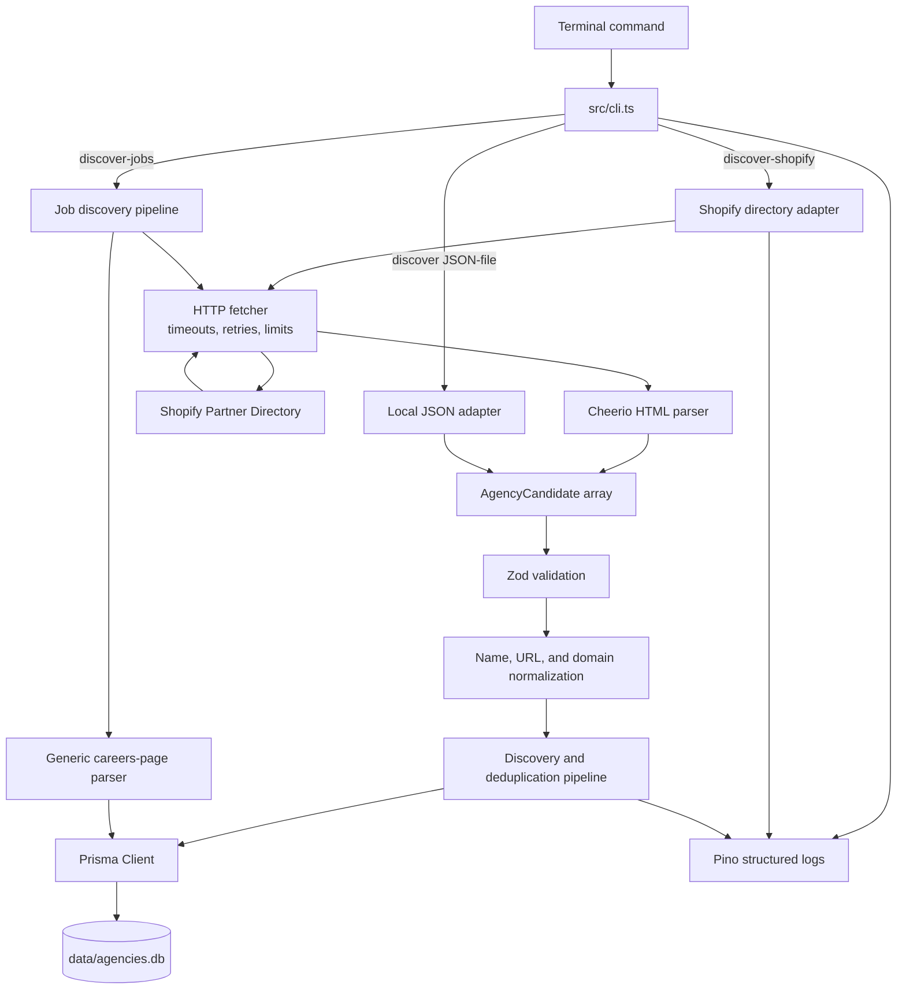
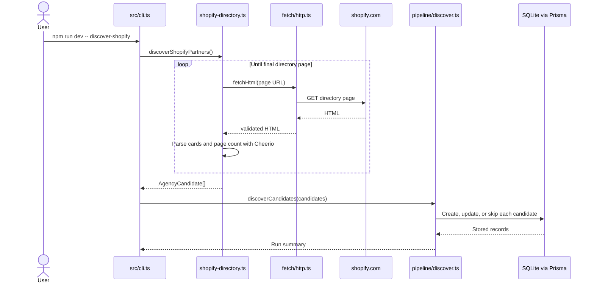

# Agency Discovery

A local TypeScript CLI for discovering development agencies from public directories, normalizing their URLs, preventing duplicate records, and saving candidates to SQLite.

This project is source-agnostic and is being built incrementally. Shopify's public Partner Directory is the first discovery adapter; additional agency directories can be added behind the same candidate interface. The current rollout also discovers individual openings from stored careers pages. Agency classification, ATS-specific adapters, resume matching, and application automation remain future work.

## Current capabilities

- Crawl the public Shopify service-partner directory across dynamically detected pages.
- Extract partner names and Shopify profile URLs with Cheerio.
- Extract official homepages from Shopify partner profiles and follow redirects.
- Find linked careers pages and check a bounded set of common careers paths.
- Extract job titles and application URLs from supported static careers-page layouts.
- Deduplicate jobs across runs and track whether previously seen openings remain active.
- Import candidates from a local JSON file for controlled testing.
- Validate runtime data and configuration with Zod.
- Normalize URLs, remove tracking parameters, and extract registrable domains.
- Prevent duplicate candidates across repeated discovery runs.
- Persist records locally in SQLite through Prisma.
- Emit structured progress and error logs with Pino.
- Apply request timeouts, retries, response-size limits, and a delay between Shopify pages.

The Shopify directory contains agencies, freelancers, and other service partners. Discovery intentionally stores all official listings; a later verification stage will determine which records are agencies.

## Architecture



### Shopify discovery flow



Homepage and careers enrichment is a second command that processes stored candidates in safe batches:

```text
DISCOVERED record
  → Shopify partner profile
  → official external homepage
  → canonical domain
  → homepage careers links
  → bounded common-path fallbacks
  → CAREERS_CHECKED
```

Job discovery is a separate, repeatable stage:

```text
stored careers URL
  → validate careers page
  → extract role cards and job links
  → normalize and deduplicate openings
  → save Job records
  → mark missing previously-seen jobs inactive
```

## Technology

- Node.js 20
- TypeScript
- `tsx`
- Cheerio
- Playwright (reserved for pages that require browser rendering)
- Prisma
- SQLite
- Zod
- Pino
- `tldts`

## Project structure

```text
.
├── data/
│   ├── agencies.db                 # Local database; ignored by Git
│   └── candidates.example.json     # Example manual input
├── prisma/
│   ├── migrations/                 # Database migrations
│   └── schema.prisma               # Agency and Job models and statuses
├── src/
│   ├── cli.ts                      # CLI entry point and command routing
│   ├── config.ts                   # Zod-validated environment configuration
│   ├── db.ts                       # Shared Prisma client
│   ├── logger.ts                   # Shared Pino logger
│   ├── discovery/
│   │   ├── types.ts                # Common candidate contract
│   │   └── sources/
│   │       ├── local-json.ts        # Local JSON discovery adapter
│   │       └── shopify-directory.ts # Shopify directory adapter and parser
│   ├── fetch/
│   │   └── http.ts                 # Bounded HTTP fetching and retries
│   ├── jobs/
│   │   ├── generic-parser.ts       # Static careers-page job extraction
│   │   └── types.ts                # Job validation, normalization, and identity
│   ├── pipeline/
│   │   ├── discover.ts             # Agency persistence and deduplication
│   │   ├── discover-jobs.ts        # Job discovery and persistence
│   │   └── enrich.ts               # Homepage and careers enrichment
│   └── utils/
│       ├── domain.ts               # Canonical domain helpers
│       └── url.ts                  # URL parsing and normalization
└── tests/unit/                     # Unit and fixture-style parser tests
```

## Setup

### 1. Select Node.js

Install NVM if necessary, then from the project root run:

```bash
nvm use
```

The repository's `.nvmrc` selects Node.js 20.12.2.

### 2. Install dependencies

```bash
npm install
```

### 3. Configure the environment

```bash
cp .env.example .env
```

Default configuration:

```env
DATABASE_URL="file:../data/agencies.db"
LOG_LEVEL="info"
```

### 4. Create or update the database

```bash
npm run db:migrate
```

### 5. Verify the project

```bash
npm run typecheck
npm test
npm run dev
```

The last command runs the default `status` command and reports the number of stored agencies.

## Usage

### Check database status

```bash
npm run dev
```

Equivalent explicit command:

```bash
npm run dev -- status
```

### Test Shopify discovery with one page

Start with a bounded run. One page currently contains approximately 16 partners:

```bash
npm run dev -- discover-shopify 1
```

The number after `discover-shopify` is the maximum number of directory pages to process.

### Discover the complete Shopify directory

```bash
npm run dev -- discover-shopify
```

The adapter reads the current result count, calculates pagination dynamically, waits between requests, and stops at the last page. A complete run may take several minutes. Re-running it is safe: existing candidates are updated or skipped instead of duplicated.

### Import candidates from JSON

Edit or copy `data/candidates.example.json`, then run:

```bash
npm run dev -- discover data/candidates.example.json
```

Candidate format:

```json
[
  {
    "name": "Example Shopify Agency",
    "websiteUrl": "https://www.example.com",
    "sourceUrl": "https://directory.example/agency/example",
    "discoverySource": "local-example",
    "evidence": "Listed as a Shopify development agency."
  }
]
```

`websiteUrl` and `evidence` are optional. The name, source URL, and discovery source are required.

### Find official homepages and careers pages

Process the next 25 eligible Shopify candidates:

```bash
npm run dev -- enrich
```

Use a smaller or larger batch:

```bash
npm run dev -- enrich 10
```

Process every remaining eligible candidate:

```bash
npm run dev -- enrich all
```

Start with a small batch. Each record requires the Shopify profile, the official homepage, and potentially several common careers paths. Successful records store `websiteUrl`, `canonicalDomain`, `careersUrl` when found, verification timestamps, and `CAREERS_CHECKED` status. A checked null careers URL is a valid result.

### Inspect stored data

```bash
npm run db:studio
```

Prisma Studio opens a local browser interface for the `Agency` and `Job` tables. No MySQL, PostgreSQL, or separate database server is required.

### Discover jobs from stored careers pages

Start with two agencies:

```bash
npm run dev -- discover-jobs 2
```

The command defaults to 10 agencies. To process every agency that currently has a careers URL:

```bash
npm run dev -- discover-jobs all
```

Each run processes agencies whose job check is oldest first. It stores normalized job records and refreshes previously discovered openings. A zero-result parse does not deactivate existing jobs, which protects stored data when a site changes unexpectedly.

## Commands

| Command | Purpose |
| --- | --- |
| `npm run dev` | Show database status. |
| `npm run dev -- discover-shopify [maxPages]` | Discover Shopify directory candidates. |
| `npm run dev -- discover <file>` | Import candidates from JSON. |
| `npm run dev -- enrich [limit\|all]` | Resolve homepages and find careers pages; defaults to 25 records. |
| `npm run dev -- discover-jobs [limit\|all]` | Find and store jobs from careers pages; defaults to 10 agencies. |
| `npm test` | Run automated tests. |
| `npm run typecheck` | Check TypeScript types. |
| `npm run db:migrate` | Apply Prisma migrations. |
| `npm run db:generate` | Regenerate Prisma Client. |
| `npm run db:studio` | Inspect the SQLite database. |

## Data lifecycle

New Shopify directory records are saved with the `DISCOVERED` status. The intended status progression is:

```text
DISCOVERED
  → WEBSITE_VERIFIED
  → SHOPIFY_VERIFIED
  → CAREERS_CHECKED
  → COMPLETE
```

`REJECTED` is used for records that are not relevant agencies or cannot be verified. `FAILED` is reserved for retryable processing failures.

## Current limitations

- The directory includes individuals and non-agency service partners; classification is not implemented yet.
- Careers detection uses static HTML and bounded common paths; JavaScript-only navigation may require the planned Playwright fallback.
- Job discovery currently uses a conservative generic static-HTML parser; ATS-specific and JavaScript-rendered listings need dedicated adapters or a Playwright fallback.
- Location, employment type, full descriptions, and posted dates are only stored when a future source adapter supplies them.
- Resume parsing, relevance scoring, and application submission are intentionally not implemented yet.
- Shopify can change its HTML structure; parser tests cover the expected structure, but selectors may eventually require maintenance.
- This is a personal local tool, not a distributed crawler.

## Planned next stages

1. Distinguish agencies from freelancers and irrelevant service providers.
2. Detect known ATS providers and add provider-specific job adapters.
3. Add a Playwright fallback for JavaScript-only websites.
4. Perform final domain-based deduplication and provenance merging.
5. Add resume ingestion and explainable job relevance scoring.
6. Add a review queue before any assisted application workflow.

## Responsible use

The fetcher identifies itself, rate-limits directory pagination, bounds retries, and avoids attempts to bypass CAPTCHAs or access controls. Before large or repeated runs, review Shopify's current terms and crawling policies. Keep concurrency and request volume conservative.

See [PLAN.md](./PLAN.md) for the complete MVP plan and scope boundaries.
